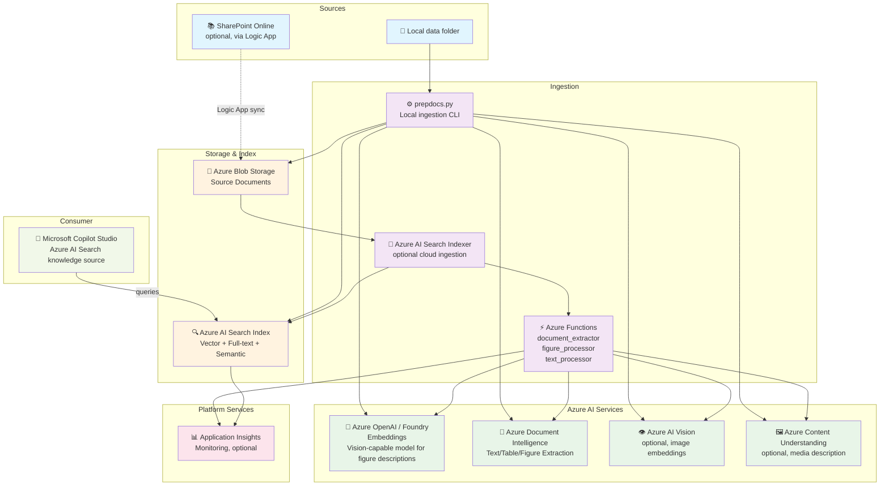
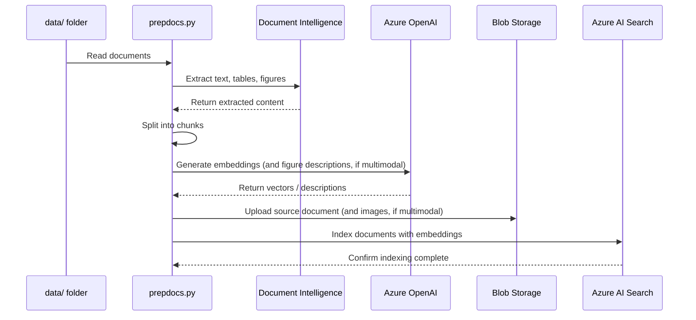

# Application Architecture

This document provides a detailed architectural overview of this project: an Azure AI Search ingestion pipeline that populates an index for Microsoft Copilot Studio's native "Azure AI Search" knowledge source connector. There is no chat UI or chat backend in this repository — Copilot Studio (or any other querying client) is responsible for the conversational experience and for querying the index directly.

For getting started with the application, see the main [README](../README.md).

## Architecture Diagram

The following diagram illustrates the ingestion pipeline components and how they connect to Azure services, plus how a querying client consumes the resulting index.

A detailed, presentation-ready version is maintained as a draw.io source file: **[docs/diagrams/architecture.drawio](diagrams/architecture.drawio)**. Open it with [diagrams.net](https://app.diagrams.net) or the VS Code *Draw.io Integration* extension. It follows Azure Architecture Center conventions — dashed boundary boxes per platform scope, a numbered dataflow cross-referenced to a panel that states the rationale for each step, and cross-cutting notes on identity, networking and observability. Every service card carries a dashed `LOGO` placeholder sized for the official Azure/Microsoft service icons: select the placeholder, delete it, and paste the real icon in its place.

## Local Ingestion Flow

The following diagram shows how `prepdocs.py` processes documents from the local `data` folder:

## Cloud Ingestion Flow

When `USE_CLOUD_INGESTION` is enabled, an Azure AI Search indexer drives the same processing steps using Azure Functions as custom skills, instead of running `prepdocs.py` locally. See [the data ingestion guide](data_ingestion.md#cloud-ingestion) for the full skillset architecture.

## Key Components

### Ingestion (Python)

- **app/backend/prepdocslib**: Shared parsing, chunking, embedding, and Azure AI Search index/indexer management library, used by both local and cloud ingestion. See [AGENTS.md](../AGENTS.md#overall-code-layout) for a file-by-file breakdown.
- **app/backend/prepdocs.py**: CLI entry point for local ingestion.
- **app/backend/setup_cloud_ingestion.py**: Configures the Azure AI Search indexer/skillset for cloud ingestion.
- **app/functions**: Azure Functions implementing the document-extraction, figure-processing, and text-processing custom skills used by cloud ingestion.

### Azure Services Integration

- **Azure AI Search**: Hosts the index queried by Copilot Studio, and (for cloud ingestion) the indexer and skillset.
- **Azure OpenAI / Foundry**: Provides the embedding model, and a vision-capable model used only for ingestion-time figure descriptions.
- **Azure Document Intelligence**: Extracts text, tables, and figures from PDFs, Office documents, and images.
- **Azure Blob Storage**: Stores the original documents that feed ingestion.
- **Application Insights**: Provides monitoring and telemetry for Azure AI Search operations and (if cloud ingestion is enabled) the Function Apps.

## Optional Features

The architecture supports several optional features that can be enabled. For detailed configuration instructions, see the [optional features guide](deploy_features.md):

- **Multimodal ingestion**: Image embeddings and figure descriptions for image-heavy documents.
- **Cloud ingestion**: Runs ingestion as an Azure AI Search indexer + Azure Functions pipeline instead of a local script.
- **Document-level access control**: Restricts which documents a querying user can see.
- **Private endpoints**: Network isolation for enhanced security.
- **SharePoint sync**: An optional Azure Logic App that syncs documents from SharePoint Online into Blob Storage — see [the Copilot Studio integration guide](copilot_studio_integration.md).
</content>
